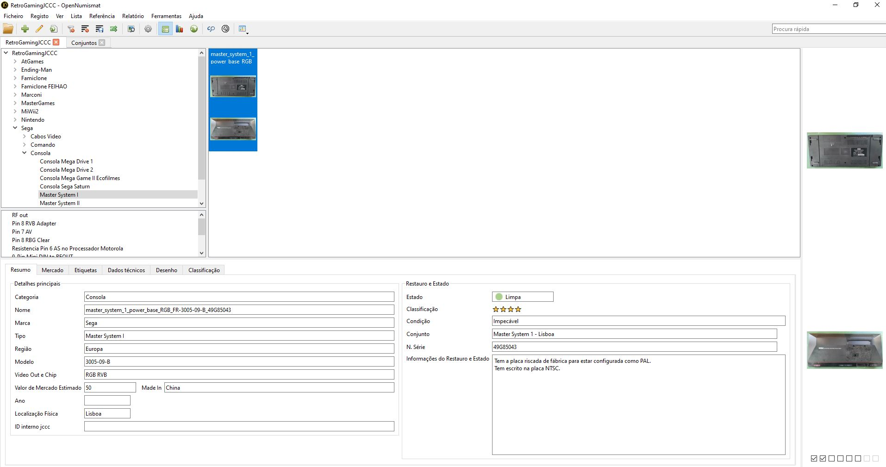
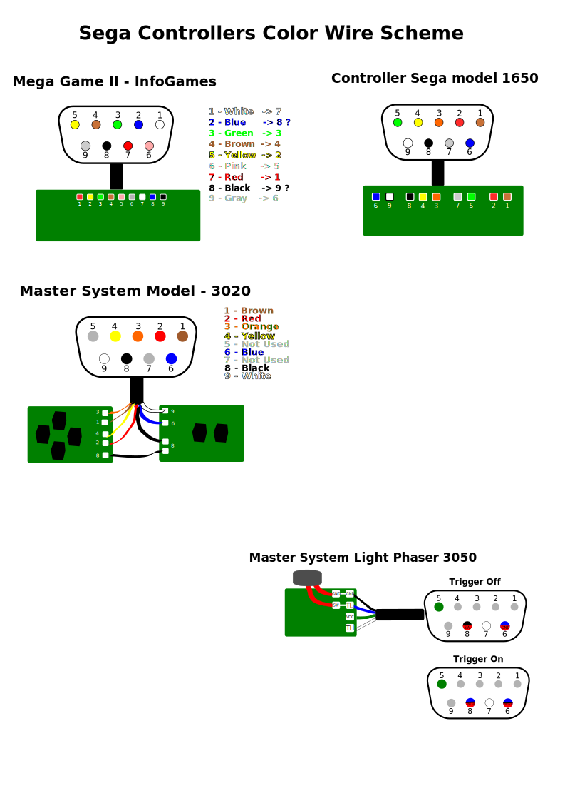

# RetroConsolesCollectionStuff
Stuff to share

## OpenNumismatRetroGaming
Portuguese template db to aplly on opennumismat to organize and keep tracking of your collection:
* Download https://opennumismat.github.io/pt/ 
* Execute OpenNumismat.exe one first time and close 
* Replace default MyCollection.db and .ref file by these ones:

Example:

## SegaControllersColorWireScheme
SVG illustrating the wire colours and connections to the controller board

